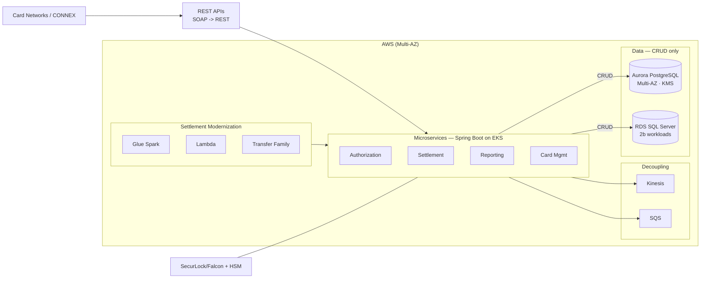
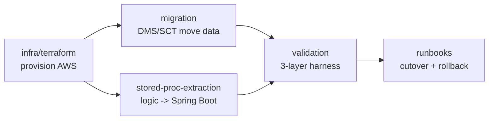

# Green Dot "Sunrise" Prepaid Modernization — FIS + AWS

**Engagement:** Sunrise (Green Dot Prepaid platform, delivered via FIS), AWS + Vertical Relevance
**Type:** Application + Database modernization program
**Scope:** Off SQL Server 2016 → AWS, HA/DR to 99.99%, decouple app/DB, stored-proc logic → app tier, EC2 SQL Server → RDS Aurora PostgreSQL

> **Read [`docs/05-project-context.md`](docs/05-project-context.md) first** — it is the source
> of truth captured from the AWS proposal slides.

---

## 1. The Problem in One Paragraph

The Green Dot **Sunrise** prepaid platform runs **on-prem** across **Phoenix (primary)** and
**Little Rock (secondary)** data centers on **SQL Server 2016** (end of extended support
**Jul 14, 2026**). It has **68 databases** on the Simple recovery model with **no HA and no
point-in-time recovery**, a fragile **bi-directional replication** mesh (**1,771 articles /
7 business purposes**), tightly-coupled application + database, manual deployments (~1
day/server), peak-sized manual scaling, and high SQL Server licensing cost. Availability is
**99.95%** against a **99.99%** objective. AWS proposes a **two-phase, 46-week / 23-sprint**
modernization: **Phase 1** lifts to AWS with HA/DR and DevOps; **Phase 2** re-architects the
app (stored-proc logic → **Java/Spring Boot on EKS**, DB becomes **CRUD-only**), converts
**SOAP → REST**, and re-platforms **EC2 SQL Server → RDS Aurora PostgreSQL** with **KMS**
replacing TDE.

## 2. Target Architecture at a Glance (Phase 2)

## 3. Key AWS Building Blocks

| Concern | AWS Service | Why |
|---------|-------------|-----|
| App hosting | **Amazon EKS** (multi-AZ autoscaling) | Containerized microservices, horizontal scale |
| DB — Phase 1 HA | **SQL Server on EC2 Multi-AZ + Always On AG** | Fast 99.99% HA before EOL, app-behavior-preserving |
| DB — Phase 2 target | **RDS Aurora PostgreSQL** | Remove licensing, AWS-native HA/scale |
| DB — Phase 2b | **RDS SQL Server** | Managed lift for not-yet-PG-ready workloads |
| Migration | **AWS SCT + AWS DMS** | Schema/data migration + CDC + validation |
| Settlement | **Glue Spark, Lambda, Transfer Family** | Parallel settlement, cut processing time ~half |
| Decoupling | **Kinesis, SQS** | Break app/DB coupling, enable reconciliation |
| DevOps | **Terraform, CodePipeline, Image Builder** | IaC + CI/CD, chaos engineering |
| Observability | **CloudWatch, X-Ray** | Metrics/tracing + Settlement Ops UI |
| Security | **Secrets Manager, KMS (replaces TDE)** | Managed secrets & keys |

## 4. Documents in This Package

| File | Purpose |
|------|---------|
| [`docs/05-project-context.md`](docs/05-project-context.md) | **START HERE** — real current-state facts, target state, two-phase strategy (from AWS slides) |
| [`docs/06-modernization-roadmap.md`](docs/06-modernization-roadmap.md) | **46-week / 23-sprint roadmap** — Phase 1 / 2a / 2b workstreams + Gantt + governance |
| [`docs/00-architect-qa.md`](docs/00-architect-qa.md) | Every key decision answered **3 ways** — Data / Solution / Enterprise Architect — with **why / what / what-for** |
| [`docs/01-hld.md`](docs/01-hld.md) | **High-Level Design** — current→target architecture, layers, NFRs, decisions |
| [`docs/02-lld.md`](docs/02-lld.md) | **Low-Level Design** — components, settlement pipeline, Aurora schema, migration config |
| [`docs/03-diagrams.md`](docs/03-diagrams.md) | **Diagrams** — flows, sequences, stored-proc decision tree, deployment, security |
| [`docs/04-migration-strategy.md`](docs/04-migration-strategy.md) | **Migration** — **1,771-article stored-proc extraction → Spring Boot** + SQL Server → Aurora PG |

## 5. How to Read This

1. **`05` Project Context** — the real scope and facts.
2. **`06` Roadmap** — the phased plan and timeline.
3. **`00` Q&A** — *why* each decision, from all three architect lenses.
4. **`01` HLD** → **`02` LLD** — big picture then detail.
5. **`04` Migration** — the hardest part: stored-proc logic + Aurora re-platform.
6. **`03` Diagrams** — visual companion.

> All diagrams use **Mermaid** (render on GitHub). IaC examples use **Terraform**.

## 5b. End-to-End Build (IaC + Migration + Runbooks)

Beyond the design docs, this repo now contains the full **E2E implementation scaffolding**:

| Area | Path | What's inside |
|------|------|---------------|
| **Terraform IaC** | [`infra/terraform/`](infra/terraform/) | 14 beginner-friendly, commented modules + a wired `dev` environment. Foundation (network, kms, secrets, security, iam), Phase 1 (sqlserver-ec2-ag, eks, messaging, settlement, observability), Phase 2 (rds-aurora-postgresql, rds-sqlserver, dms, dr). Start at [`infra/terraform/README.md`](infra/terraform/README.md) and [`TERRAFORM-PRIMER.md`](infra/terraform/docs/TERRAFORM-PRIMER.md). |
| **Migration (data)** | [`migration/`](migration/) | SCT assessment guide, DMS runbook + task/table-mapping JSON, and the full SQL Server → PostgreSQL [`type-mapping.md`](migration/type-mapping.md) (money → `numeric(19,4)`). |
| **Stored-proc extraction** | [`stored-proc-extraction/`](stored-proc-extraction/) | Inventory + classification templates and a worked **before/after**: a T-SQL settlement proc relocated into a Spring Boot `@Service` with CRUD-only JPA repos + parity tests. |
| **Validation** | [`validation/`](validation/) | 3-layer harness: DMS row validation, financial reconciliation SQL (zero settled-amount drift), and a logic-parity approach. |
| **Runbooks** | [`runbooks/`](runbooks/) | Phase 1 AG cutover, Phase 2a Aurora cutover (per slice), 1,771-article replication decommission, and rollback. |

### How the pieces fit

> IaC is **learning-grade scaffolding** (complete and coherent, sensible defaults) — review
> sizing, CIDRs, and security before any production apply. Terraform couldn't be `validate`d in
> this sandbox (no network to the HashiCorp registry); files passed manual brace/JSON checks.

## 6. Scope Note

An earlier draft of `00`–`04` was framed as an analytics **lakehouse** (Iceberg/Athena) build.
Per the AWS slides, the real program is **app + database modernization**. `05` and `06`
reflect the corrected scope; `01`/`04` have been realigned. Sections of `02`/`03` still
contain lakehouse-oriented detail that is **optional/future** — see `05` §6 for the
reconciliation table. Analytics on Iceberg remains a valid *future* extension, not a Phase 1/2 mandate.
