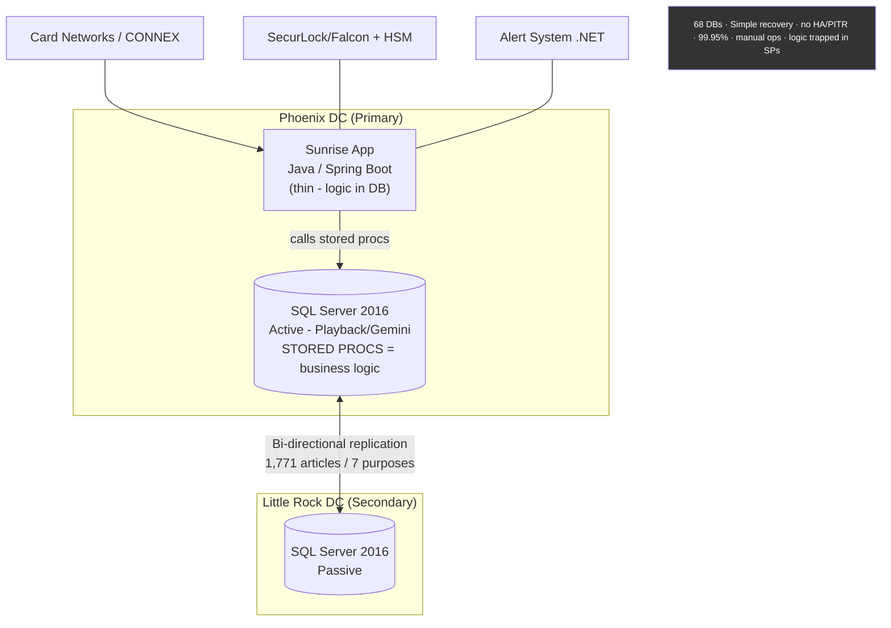
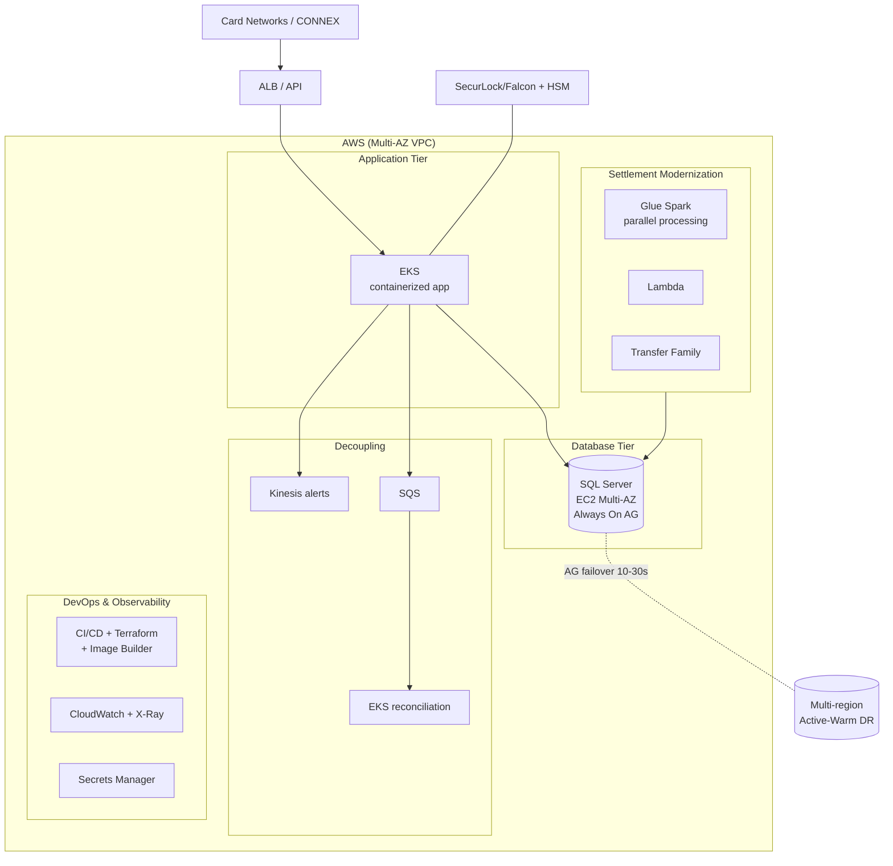
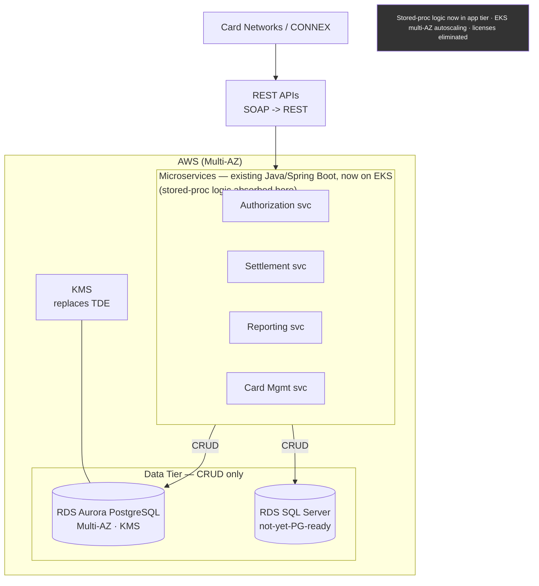
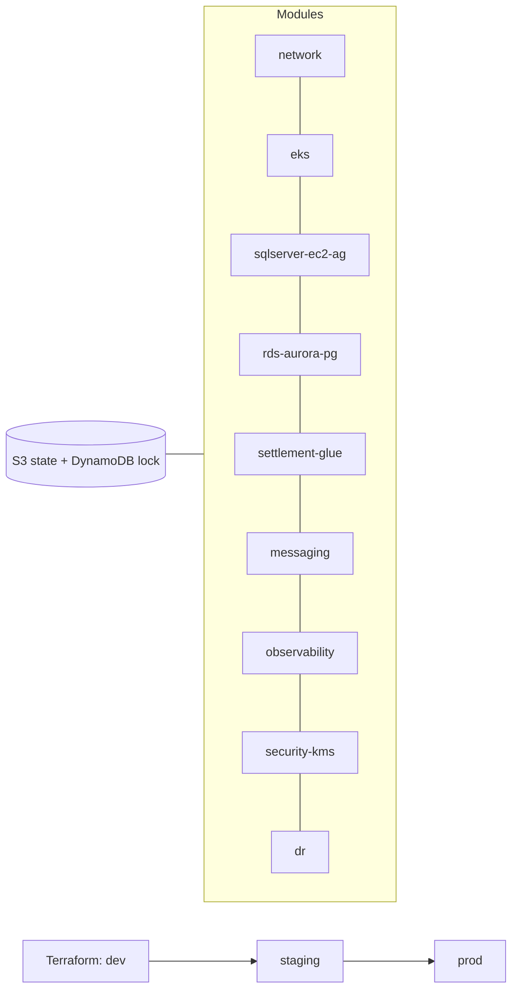

# High-Level Design (HLD) — Green Dot "Sunrise" Prepaid Modernization

> Aligns to [`docs/05-project-context.md`](05-project-context.md). This is an **application +
> database modernization** program (get off SQL Server 2016, add HA/DR, decouple app/DB,
> move stored-proc logic to an app tier, re-platform to Aurora PostgreSQL) — **not** a
> lakehouse-first build. Glue Spark is scoped to **Settlement** modernization.

## 1. Purpose & Scope

Modernize the on-prem Green Dot Sunrise prepaid platform onto AWS in two phases:
**Phase 1** lifts to AWS with HA/DR and DevOps; **Phase 2** re-architects the application
(stored-proc logic → Java/Spring Boot on EKS, DB becomes CRUD-only) and re-platforms the
database (EC2 SQL Server → RDS Aurora PostgreSQL).

**In scope:** infrastructure lift, HA/DR (Always On AG → Aurora Multi-AZ), settlement
modernization (Glue Spark/Lambda/Transfer Family), decoupling (Kinesis/SQS), DevOps
(Terraform/CI-CD), stored-proc extraction, SOAP→REST, encryption (KMS).
**Out of scope (this program):** net-new analytics lakehouse (optional future extension),
card-network protocol changes, HSM replacement.

## 2. Guiding Principles

1. **Beat the deadline** — off SQL Server 2016 before EOL (Jul 14, 2026).
2. **Availability first** — 99.95% → **99.99%** via Always On AG (Phase 1), Aurora Multi-AZ (Phase 2).
3. **Decouple app from DB** — remove locking bottlenecks; move logic out of the database.
4. **Automate everything** — IaC (**Terraform**), CI/CD, Image Builder, chaos engineering.
5. **Security by design** — Secrets Manager, **KMS replacing TDE**, least privilege.
6. **Phase & de-risk** — modernize (lift) before re-architect; keep a rollback path.
7. **Cost out** — eliminate on-prem + Windows/SQL Server licensing.

## 3. Architecture — Current State → Target State

### 3.1 Current State (on-prem)

> **The existing Sunrise application is a Java / Spring Boot app.** The heavy business logic,
> however, lives in **SQL Server stored procedures** — so the app is thin and the DB is
> "fat". Modernization keeps the Java/Spring Boot stack and **moves the SP logic up into it**
> (no language rewrite), then re-platforms the DB.

> Any **SOAP .NET** surface (e.g., the Alert System / legacy interfaces) is modernized to
> **REST** during Phase 2; the core Sunrise app itself is already Java/Spring Boot.

### 3.2 Target State — Phase 1 (Modernize on AWS)

### 3.3 Target State — Phase 2 (Re-architect)

> The **same Java / Spring Boot** codebase evolves into containerized microservices on EKS.
> The key change is **stored-proc logic is pulled into these Spring Boot services** (the app
> becomes "fat", the DB becomes CRUD-only) — a logic relocation within the existing language,
> not a rewrite into a new one.

## 4. Logical Layers (Target)

| Layer | Responsibility | Phase 1 | Phase 2 |
|-------|----------------|---------|---------|
| **Edge / API** | Ingress, protocol | ALB | **SOAP→REST** APIs |
| **Application** | Business logic | Containerized app on EKS | **Microservices (Spring Boot), SP logic extracted** |
| **Settlement** | Batch/parallel settlement | **Glue Spark + Lambda + Transfer Family** | Settlement microservice |
| **Messaging** | Decoupling | **Kinesis (alerts), SQS, EKS reconciliation** | Same, expanded |
| **Database** | Persistence | **SQL Server EC2 Multi-AZ + Always On AG** | **RDS Aurora PostgreSQL** (+ RDS SQL Server for 2b), **CRUD-only** |
| **Security** | Secrets, crypto | Secrets Manager | **KMS replacing TDE** |
| **DevOps** | IaC, CI/CD | **Terraform, CodePipeline, Image Builder, chaos eng** | Same |
| **Observability** | Metrics, tracing | **CloudWatch, X-Ray, Settlement Ops UI, runbooks** | Same |
| **DR** | Continuity | **Multi-region active-warm**, AG failover | Aurora cross-region |

## 5. Non-Functional Requirements (NFRs)

| NFR | Target | How Achieved |
|-----|--------|--------------|
| **Availability** | **99.99%** (from 99.95%) | Always On AG auto-failover (10–30s) → Aurora Multi-AZ |
| **DR** | Multi-region active-warm | Cross-region replicas, failover orchestration |
| **Recovery** | Point-in-time (was: none) | Move off Simple recovery; Aurora continuous backup |
| **Performance** | Settlement time cut ~half; support **30% YoY** | Glue Spark parallelism; remove DB locking; horizontal EKS scaling |
| **Scalability** | Beyond peak-sized capacity | EKS multi-AZ autoscaling; app-tier scaling once DB is CRUD-only |
| **Deployability** | From ~1 day/server to automated | CI/CD + Terraform + Image Builder |
| **Security** | Managed secrets & keys | Secrets Manager, KMS replacing TDE |
| **Cost** | Eliminate on-prem + Win/SQL licenses | AWS-managed services, Aurora PostgreSQL |
| **Deadline** | Off SQL 2016 before **Jul 14 2026** | Phase 1 DB modernization completes pre-EOL |

## 6. Key Design Decisions & Trade-offs

| Decision | Chosen | Alternative | Rationale |
|----------|--------|-------------|-----------|
| HA approach (Phase 1) | SQL Server **Always On AG** on EC2 Multi-AZ | RDS SQL Server immediately | Keeps app behavior identical while adding HA fast, pre-EOL |
| Target OLTP (Phase 2) | **RDS Aurora PostgreSQL** | Stay on SQL Server | Removes licensing, AWS-native, HA/scale |
| Not-ready workloads | **RDS SQL Server (Phase 2b)** | Force all to PG | Pragmatic; avoids blocking on hard-to-convert procs |
| Business logic home | **App tier (Spring Boot on EKS)**, DB CRUD-only | Keep procs in DB | Decouples, enables scale + DB portability |
| Settlement engine | **Glue Spark + Lambda + Transfer Family** | Keep monolithic batch | Parallelism cuts settlement time ~half |
| Decoupling | **Kinesis + SQS** | Point-to-point | Removes coupling, enables reconciliation service |
| IaC | **Terraform** | CloudFormation/CDK | Team preference, portability |
| Encryption | **KMS** | TDE | Centralized key mgmt, AWS-native |

## 7. Environment & Deployment (Terraform)

- **IaC:** Terraform, modular: `network`, `eks`, `sqlserver-ec2-ag`, `rds-aurora-pg`,
  `rds-sqlserver`, `settlement-glue`, `messaging-kinesis-sqs`, `observability`, `security-kms-secrets`, `dr`.
- **Environments:** dev → staging → prod (isolated accounts/VPCs), promoted via CI/CD.
- **State:** remote in S3 + DynamoDB lock table. **Image Builder** pipeline for AMIs.

## 8. Risks & Mitigations

| Risk | Mitigation |
|------|------------|
| SQL Server 2016 **EOL (Jul 14 2026)** | Phase 1 DB modernization ahead of EOL; AG for HA |
| **1,771-article** bi-directional replication is fragile | Keep until app-tier CRUD proven; decommission in stages |
| Stored-proc extraction underestimated | Inventory + classify early (Phase 1); size per proc — see `04` |
| Aurora cutover data/logic parity | DMS validation + financial reconciliation + parallel run |
| Money precision (SQL→PG) | `numeric(19,4)`, explicit rounding, reconciliation |
| Manual-ops regression | CI/CD + Terraform + runbooks + chaos testing |
| Cost overrun | FinOps tagging, budgets, right-sizing off peak-capacity model |

## 9. Consumption / Integrations (unchanged externally)

- **Card networks / CONNEX**, **SecurLock (Falcon) + HSM**, **Alert System** remain external
  integrations; the modernization preserves these contracts while changing the internals
  (SOAP→REST at the edge where applicable).
- **Reporting** continues; **Settlement Ops UI** added for operability.
