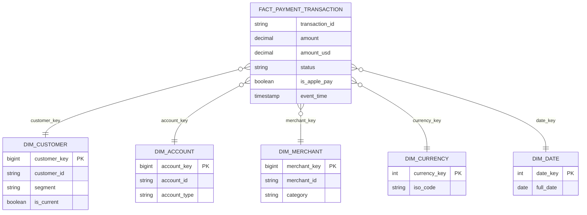
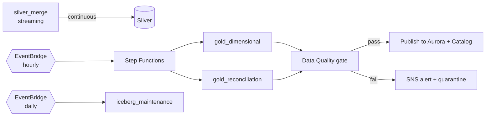

# Low-Level Design (LLD) — Sunrise / FIS Payments Data Platform

This document details the concrete implementation: Kafka topics, DMS config, Glue jobs,
Iceberg DDL, Aurora schema, data models, and error handling.

> **Context:** Customers send payment-transaction data via an **Apple Pay** integration. FIS
> ingests these as high-volume events. Source-of-truth is **SQL Server**; target operational
> store is **Aurora PostgreSQL**; analytics land in **Iceberg on S3**.

---

## 1. Ingestion — Amazon MSK (Kafka)

### 1.1 Topic Design

| Topic | Partitions | Key | Retention | Purpose |
|-------|-----------|-----|-----------|---------|
| `payments.transactions.cdc` | 24 | `transaction_id` hash | 7 days | Raw CDC change events from SQL Server |
| `payments.applepay.events` | 12 | `customer_id` | 7 days | Apple Pay authorization/settlement events |
| `payments.transactions.dlq` | 6 | `transaction_id` | 14 days | Poison / malformed records |

- **Partitioning by key** guarantees per-transaction ordering.
- **Partition count** sized for target throughput (each partition ~10 MB/s; 24 partitions ≈ high burst headroom).
- **Schema Registry** (Glue) enforces Avro schemas with `BACKWARD` compatibility.

### 1.2 Event Schema (Avro, simplified)

```json
{
  "type": "record",
  "name": "PaymentTransactionChange",
  "namespace": "com.fis.sunrise.payments",
  "fields": [
    {"name": "op", "type": {"type": "enum", "name": "Op", "symbols": ["c","u","d","r"]}},
    {"name": "ts_ms", "type": "long"},
    {"name": "transaction_id", "type": "string"},
    {"name": "account_id", "type": "string"},
    {"name": "customer_id", "type": "string"},
    {"name": "merchant_id", "type": ["null","string"], "default": null},
    {"name": "amount", "type": {"type": "bytes", "logicalType": "decimal", "precision": 19, "scale": 4}},
    {"name": "currency", "type": "string"},
    {"name": "payment_method", "type": "string"},
    {"name": "wallet_type", "type": ["null","string"], "default": null},
    {"name": "status", "type": "string"},
    {"name": "event_time", "type": {"type": "long", "logicalType": "timestamp-millis"}}
  ]
}
```

> `wallet_type = "APPLE_PAY"` distinguishes Apple Pay flows; `amount` uses decimal logical type to preserve money precision.

---

## 2. CDC & Migration — AWS DMS

### 2.1 DMS Setup

- **Replication instance:** `dms.c5.2xlarge` (multi-AZ), sized to source change rate.
- **Source endpoint:** SQL Server with **MS-CDC** enabled (`sp_cdc_enable_table` on payment tables). Requires `sysadmin`/`db_owner` for setup and transaction-log access.
- **Two target endpoints:**
  1. **Kafka (MSK)** target → `payments.transactions.cdc` (for the lakehouse).
  2. **Aurora PostgreSQL** target → operational replica.

### 2.2 Task Configuration

| Task | Migration Type | Notes |
|------|----------------|-------|
| `full-load-and-cdc-aurora` | `full-load-and-cdc` | Initial load then continuous replication to Aurora |
| `cdc-to-kafka` | `cdc` | Change events to MSK for streaming lakehouse |

Key DMS task settings:
- `TargetTablePrepMode: DO_NOTHING` (schema pre-created via SCT).
- **LOB handling:** limited LOB mode with sized max, or full-LOB for large fields.
- **Validation:** `EnableValidation: true` for row-level reconciliation.
- **Table mappings:** include `dbo.payment_transaction`, `dbo.account`, `dbo.customer`, `dbo.merchant`.

### 2.3 Type Mapping (SQL Server → PostgreSQL)

| SQL Server | PostgreSQL | Reason |
|------------|-----------|--------|
| `DATETIME2` | `timestamptz` | Timezone-aware timestamps |
| `MONEY` / `DECIMAL(19,4)` | `numeric(19,4)` | Exact money precision |
| `UNIQUEIDENTIFIER` | `uuid` | Native UUID |
| `BIT` | `boolean` | Boolean semantics |
| `NVARCHAR(MAX)` | `text` | Unbounded text |
| `VARBINARY` | `bytea` | Binary |
| `IDENTITY` | `GENERATED ... AS IDENTITY` / sequence | Auto-increment equivalent |

> **Stored-procedure business logic is NOT handled by DMS** — DMS moves *data*, not *code*. See
> [`docs/04-migration-strategy.md`](04-migration-strategy.md) for the stored-proc migration plan.

---

## 3. Aurora PostgreSQL — Operational Schema

```sql
-- Operational payment transaction table (target of DMS)
CREATE TABLE payments.payment_transaction (
    transaction_id   uuid PRIMARY KEY,
    account_id       uuid NOT NULL,
    customer_id      uuid NOT NULL,
    merchant_id      uuid,
    amount           numeric(19,4) NOT NULL,
    currency         char(3) NOT NULL,
    payment_method   varchar(30) NOT NULL,
    wallet_type      varchar(20),          -- 'APPLE_PAY', etc.
    status           varchar(20) NOT NULL, -- AUTHORIZED, SETTLED, DECLINED, REFUNDED
    event_time       timestamptz NOT NULL,
    created_at       timestamptz NOT NULL DEFAULT now(),
    updated_at       timestamptz NOT NULL DEFAULT now()
);

CREATE INDEX ix_txn_account   ON payments.payment_transaction (account_id);
CREATE INDEX ix_txn_customer  ON payments.payment_transaction (customer_id);
CREATE INDEX ix_txn_eventtime ON payments.payment_transaction (event_time);
CREATE INDEX ix_txn_status    ON payments.payment_transaction (status);
```

- **Aurora config:** PostgreSQL 15+, multi-AZ writer + ≥1 reader, storage auto-scaling, Performance Insights on.
- Curated Gold aggregates land in a separate `analytics` schema for API serving.

---

## 4. Glue / PySpark Processing

### 4.1 Job Inventory

| Job | Type | Source → Target | Trigger |
|-----|------|-----------------|---------|
| `bronze_ingest` | Streaming | MSK → S3 Bronze (Iceberg) | Continuous |
| `silver_merge` | Streaming | MSK → Silver Iceberg (`MERGE`) | Continuous |
| `gold_dimensional` | Batch | Silver → Gold facts/dims | Hourly |
| `gold_reconciliation` | Batch | Silver → recon aggregates | Daily |
| `iceberg_maintenance` | Batch | Compaction + expire snapshots | Daily |

### 4.2 Silver CDC Merge (PySpark, illustrative)

```python
# Glue Streaming: consume MSK, apply CDC upserts into Silver Iceberg
from awsglue.context import GlueContext
from pyspark.sql import functions as F
from pyspark.sql.window import Window

# 1. Read change events from MSK (Avro, via Schema Registry)
raw = (spark.readStream.format("kafka")
       .option("kafka.bootstrap.servers", MSK_BOOTSTRAP)
       .option("subscribe", "payments.transactions.cdc")
       .option("startingOffsets", "latest")
       .load())

def upsert_to_iceberg(batch_df, batch_id):
    # 2. Deduplicate: keep latest change per transaction_id
    w = Window.partitionBy("transaction_id").orderBy(F.col("ts_ms").desc())
    latest = (batch_df
              .withColumn("rn", F.row_number().over(w))
              .filter("rn = 1").drop("rn"))
    latest.createOrReplaceTempView("changes")

    # 3. MERGE: handle inserts/updates/deletes (op = c/u/d)
    spark.sql("""
        MERGE INTO glue_catalog.silver.payment_transaction t
        USING changes s
        ON t.transaction_id = s.transaction_id
        WHEN MATCHED AND s.op = 'd' THEN DELETE
        WHEN MATCHED AND s.op IN ('u','c') THEN UPDATE SET *
        WHEN NOT MATCHED AND s.op <> 'd' THEN INSERT *
    """)

(raw.writeStream
    .foreachBatch(upsert_to_iceberg)
    .option("checkpointLocation", "s3://sunrise-checkpoints/silver/")
    .trigger(processingTime="1 minute")
    .start().awaitTermination())
```

- **Idempotency:** `MERGE` on primary key + dedupe window → safe re-processing.
- **Checkpointing:** S3 checkpoint enables exactly-once-ish streaming recovery.

### 4.3 Data Quality (Glue Data Quality / Deequ ruleset)

```
Rules = [
  IsComplete "transaction_id",
  IsUnique "transaction_id",
  IsComplete "amount",
  ColumnValues "amount" >= 0,
  ColumnValues "currency" in ["USD","EUR","GBP",...],
  ColumnValues "status" in ["AUTHORIZED","SETTLED","DECLINED","REFUNDED"]
]
```

Failures → `payments.transactions.dlq` topic / S3 quarantine prefix + CloudWatch alarm.

---

## 5. Iceberg Lakehouse — DDL

### 5.1 Silver (conformed current-state)

```sql
CREATE TABLE glue_catalog.silver.payment_transaction (
    transaction_id   string,
    account_id       string,
    customer_id      string,
    merchant_id      string,
    amount           decimal(19,4),
    currency         string,
    payment_method   string,
    wallet_type      string,
    status           string,
    event_time       timestamp,
    _ingested_at     timestamp
)
USING iceberg
PARTITIONED BY (days(event_time))
TBLPROPERTIES (
    'format-version'='2',
    'write.merge.mode'='merge-on-read',
    'write.target-file-size-bytes'='134217728'
);
```

### 5.2 Gold — Dimensional Model

```sql
-- Fact: one row per payment transaction event
CREATE TABLE glue_catalog.gold.fact_payment_transaction (
    transaction_id     string,
    account_key        bigint,
    customer_key       bigint,
    merchant_key       bigint,
    currency_key       int,
    date_key           int,
    amount             decimal(19,4),
    amount_usd         decimal(19,4),
    status             string,
    is_apple_pay       boolean,
    event_time         timestamp
) USING iceberg PARTITIONED BY (date_key);

-- Dimension: customer (SCD Type 2)
CREATE TABLE glue_catalog.gold.dim_customer (
    customer_key       bigint,     -- surrogate
    customer_id        string,     -- natural
    customer_name      string,
    segment            string,
    effective_from     timestamp,
    effective_to       timestamp,
    is_current         boolean
) USING iceberg;
```

Other dims: `dim_account`, `dim_merchant`, `dim_currency`, `dim_date`.

---

## 6. Star Schema (ERD)



---

## 7. Orchestration



- **Step Functions** coordinate batch Gold jobs with retry/catch.
- **EventBridge** schedules; **SNS** alerts on failure; failures quarantine, don't corrupt Gold.

---

## 8. Error Handling & Recovery

| Failure | Handling |
|---------|----------|
| Malformed event | Route to `dlq` topic + quarantine prefix; alarm |
| DQ rule breach | Fail the batch, quarantine, no Gold publish |
| Glue job crash | Step Functions retry w/ backoff; streaming resumes from checkpoint |
| Bad Gold build | Iceberg time-travel rollback to prior snapshot |
| DMS CDC lag | CloudWatch alarm on `CDCLatencyTarget`; scale replication instance |
| Reprocessing needed | Replay from Kafka retention + re-run MERGE (idempotent) |

---

## 9. Observability

- **CloudWatch metrics:** MSK consumer lag, DMS CDC latency, Glue DPU usage/duration, Aurora CPU/connections.
- **CloudWatch alarms:** consumer lag > threshold, DLQ depth > 0, DQ failure, DMS latency.
- **Lineage:** Glue Catalog + OpenLineage; audit via CloudTrail.
- **Cost:** FinOps tags per pipeline; Glue worker caps; Iceberg retention/compaction.

---

## 10. Security Detail

- **Encryption:** KMS CMKs for S3, Aurora, MSK; TLS in transit everywhere.
- **Access:** Lake Formation column/row-level grants; IAM least-privilege job roles.
- **PCI:** Tokenize PAN at ingestion (do not persist raw PAN in lake); Apple Pay uses DPAN (device tokens) — store tokenized references only.
- **Secrets:** DMS/DB credentials in Secrets Manager with rotation.
- **Network:** All components in private subnets; VPC endpoints for S3/Glue/Secrets.
