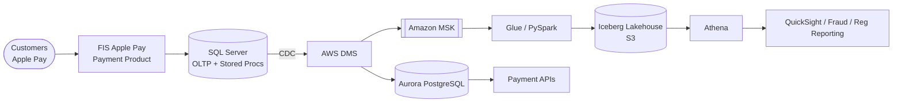
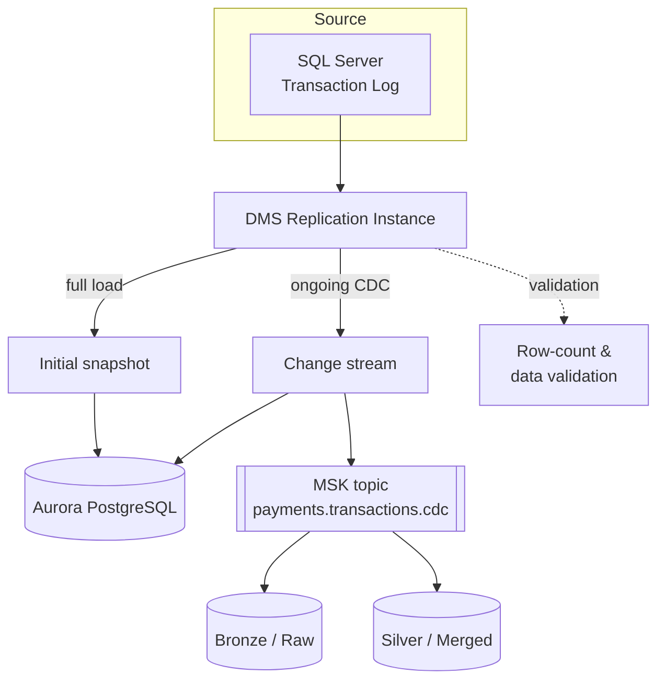
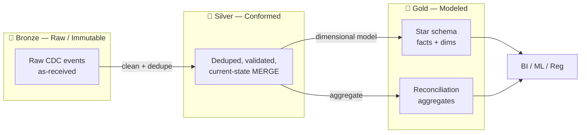
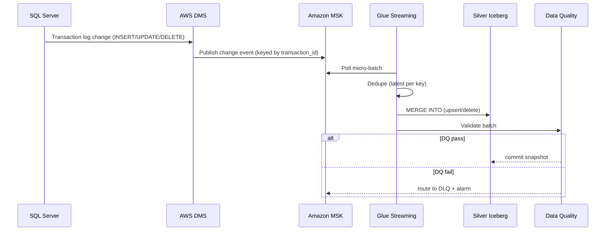
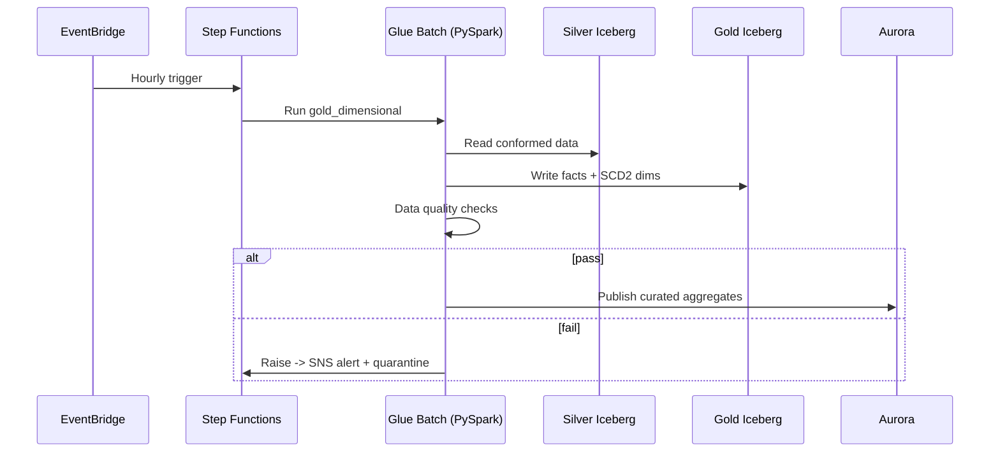
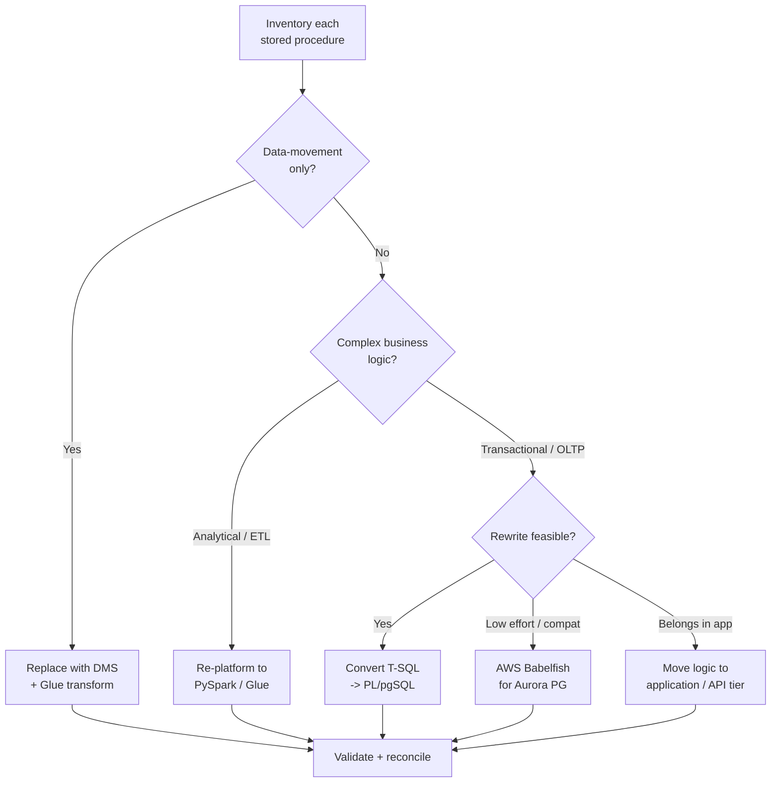
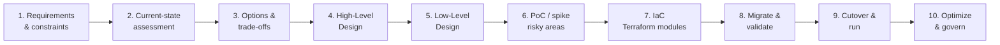
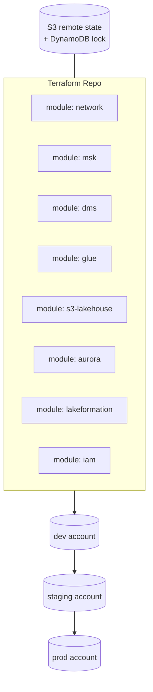
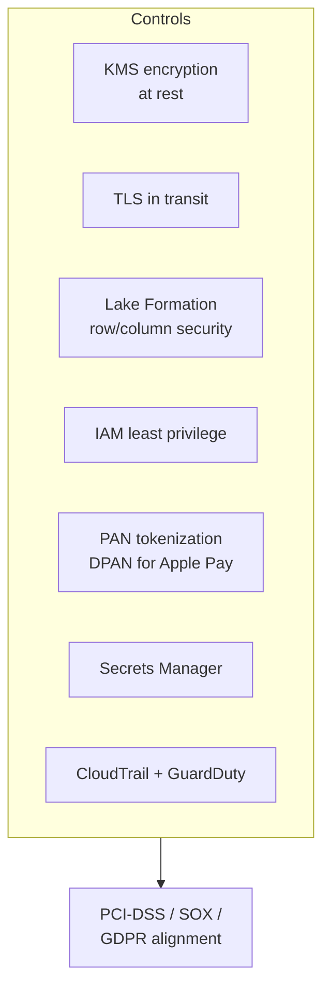

# Design & Process Diagrams — Sunrise / FIS Payments Data Platform

All diagrams are **Mermaid** and render on GitHub. This is the visual companion to the HLD/LLD.

---

## 1. End-to-End Data Flow (Context)

---

## 2. CDC Migration Flow (SQL Server → Aurora + Lake)

---

## 3. Medallion Architecture (Bronze → Silver → Gold)

---

## 4. Streaming Ingestion Sequence

---

## 5. Batch Gold Build Sequence

---

## 6. Stored-Procedure Migration Decision Tree

---

## 7. Design Process (How the Architecture Was Produced)

---

## 8. Deployment / Environments (Terraform)

---

## 9. Security / Compliance Overlay

