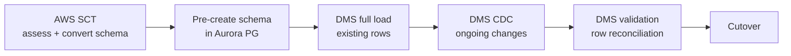
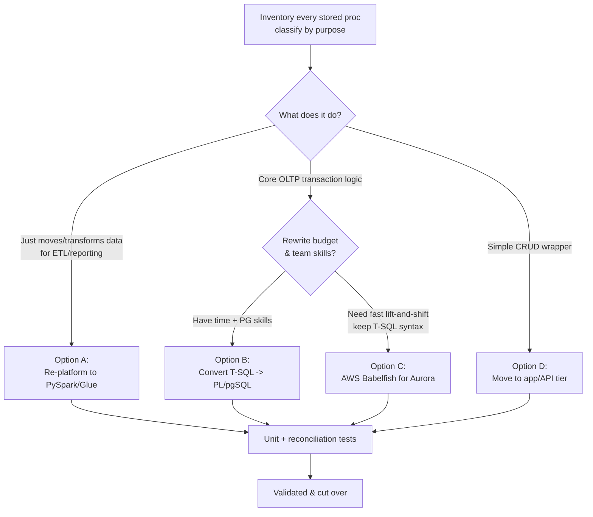
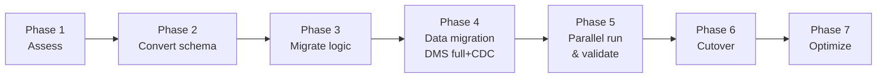
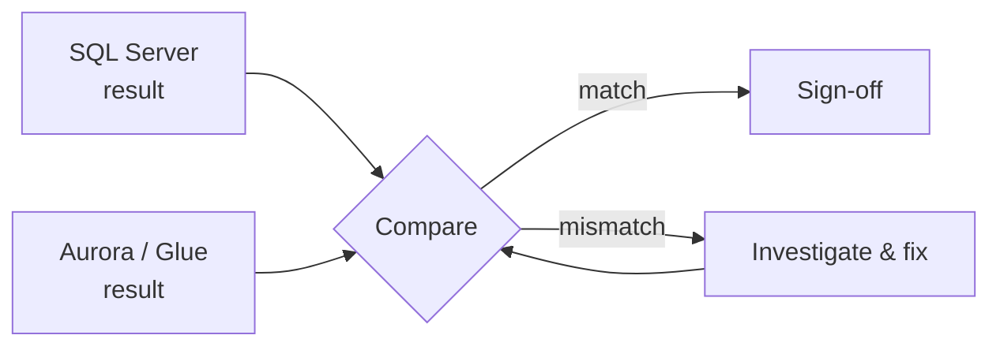
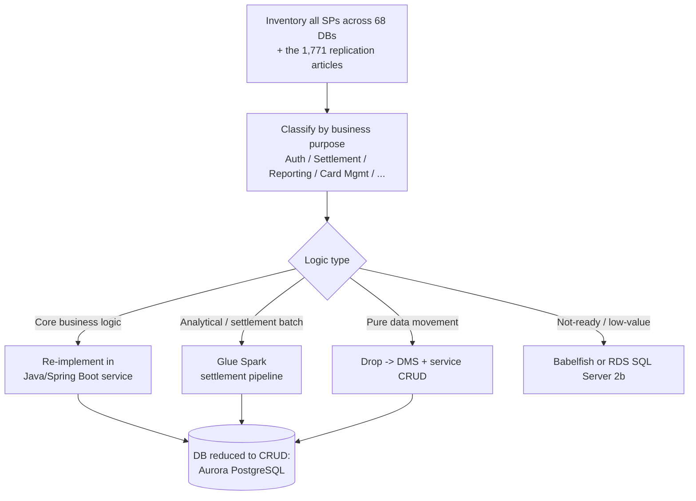
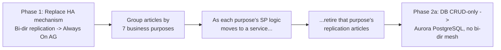

# Migration Strategy — SQL Server 2016 → RDS Aurora PostgreSQL
## Special focus: extracting the 1,771-article stored-procedure logic to the app tier

> **Context (see [`docs/05-project-context.md`](05-project-context.md)):** Green Dot Sunrise
> runs **68 SQL Server 2016 databases** with a **bi-directional replication mesh of 1,771
> articles across 7 business purposes**. The re-architecture goal (Phase 2) is to
> **extract stored-procedure business logic into Java/Spring Boot microservices on EKS so the
> database becomes CRUD-only**, then re-platform **EC2 SQL Server → RDS Aurora PostgreSQL**
> (Phase 2a), with **RDS SQL Server** as the fallback for not-yet-PG-ready workloads (2b).
>
> **The hard part of this migration is NOT the data — it's the code.** Most business logic
> lives in **SQL Server stored procedures (T-SQL)**. **AWS DMS migrates data, not stored
> procedures.** This document lays out how to handle both, using DMS *and* alternative
> methods.

> **Deadline pressure:** SQL Server 2016 reaches **end of extended support on Jul 14, 2026** —
> the HA lift (Phase 1 Always On AG) and the eventual re-platform must be sequenced against it.

---

## 1. Two Separate Problems

| Problem | Tooling | Difficulty |
|---------|---------|------------|
| **Move the data** (tables, rows, ongoing changes) | AWS SCT (schema) + AWS DMS (data + CDC) | Well-solved, largely automated |
| **Move the logic** (stored procs, functions, triggers, T-SQL) | SCT conversion, manual rewrite, or re-platform | Hard, mostly manual, highest risk |

Treat them as **parallel workstreams** with different owners.

---

## 2. Data Migration Path (the "easy" 70%)

1. **Assess** with **AWS SCT** — generates an assessment report showing what converts
   automatically vs. what needs manual work (stored procs usually land here).
2. **Convert & pre-create** table DDL, keys, indexes in Aurora PostgreSQL (apply the
   type-mappings from the LLD, esp. `MONEY → numeric(19,4)`).
3. **DMS full load** for the initial snapshot of millions of rows.
4. **DMS CDC** keeps Aurora in sync with SQL Server during parallel run.
5. **DMS data validation** reconciles row counts and checksums.

---

## 3. Stored-Procedure Migration Path (the "hard" 30%)

**DMS does not migrate stored procedures.** You have five options. Choose per-procedure
using the decision tree below — most projects use a **mix**.

### 3.1 Decision Tree

### 3.2 The Five Options

#### Option A — Re-platform logic to PySpark / Glue *(best for ETL/analytical procs)*
- **What:** Rewrite data-processing stored procs as PySpark transforms in Glue (the medallion Silver/Gold jobs).
- **Why:** In this platform, analytical/reporting logic *belongs* in the lakehouse pipeline, not the OLTP DB. Better scaling, testability, version control.
- **What-for:** Aggregations, enrichment, reconciliation, model-building procs.
- **Trade-off:** Requires re-implementation + validation, but modernizes the architecture.

#### Option B — Convert T-SQL → PL/pgSQL *(for OLTP logic that must stay in the DB)*
- **What:** Use **AWS SCT** to auto-convert, then **manually fix** what SCT flags (SCT typically converts a large share automatically and leaves the rest as action items).
- **Why:** Keeps transactional business logic close to the data with ACID guarantees.
- **What-for:** Procs doing multi-statement transactional writes, validation, posting logic.
- **Trade-off:** Manual effort; T-SQL constructs (temp tables, `MERGE`, error handling, `@@ROWCOUNT`, cursors) need PL/pgSQL equivalents.

**Common T-SQL → PL/pgSQL conversion mappings:**

| T-SQL | PL/pgSQL |
|-------|----------|
| `CREATE PROCEDURE ... AS BEGIN` | `CREATE OR REPLACE FUNCTION ... RETURNS void AS $$ BEGIN` |
| `@variable` | `variable` (declared in `DECLARE`) |
| `ISNULL(x, y)` | `COALESCE(x, y)` |
| `GETDATE()` | `now()` / `current_timestamp` |
| `TOP n` | `LIMIT n` |
| `IDENTITY` | `GENERATED ... AS IDENTITY` / sequences |
| `TRY...CATCH` | `BEGIN ... EXCEPTION WHEN OTHERS THEN` |
| `#temptable` | `CREATE TEMP TABLE` / CTE |
| `PRINT` | `RAISE NOTICE` |
| `EXEC proc` | `CALL proc()` / `PERFORM func()` |

#### Option C — AWS Babelfish for Aurora PostgreSQL *(fastest lift-and-shift)*
- **What:** Babelfish adds a **T-SQL-compatible endpoint (TDS)** on Aurora PostgreSQL, so much existing T-SQL and app code runs with minimal changes.
- **Why:** Minimizes rewrite effort and time-to-migrate when there's a large T-SQL surface.
- **What-for:** Large stored-proc estates where a full rewrite is too costly up front.
- **Trade-off:** Not 100% T-SQL coverage — complex procs may still need adjustment; adds a compatibility layer to understand. Good as a **bridge**, with gradual modernization later.

#### Option D — Move logic to the application / API tier
- **What:** Extract business rules out of the DB into application services (e.g., payment microservices).
- **Why:** Decouples logic from the database, enables testing/CI, aligns with modern service design.
- **What-for:** CRUD wrappers, orchestration logic, rules better expressed in code.
- **Trade-off:** Requires app changes and careful transaction-boundary design.

#### Option E — Replace with DMS + downstream transform
- **What:** For procs that only *move/copy* data, drop them entirely — DMS + Glue does the movement/transformation.
- **Why:** Eliminates redundant code.
- **What-for:** Staging/copy procs, simple data-shuffling.

### 3.3 Recommended Mix for Sunrise / FIS

| Proc category | Recommended option |
|---------------|--------------------|
| Reporting / aggregation / recon | **A** — PySpark/Glue |
| Core payment posting / transactional | **B** (convert) or **C** (Babelfish bridge) |
| Data-copy / staging | **E** — drop, use DMS+Glue |
| Simple CRUD / orchestration | **D** — app tier |

---

## 4. Migration Phases (End-to-End)

| Phase | Key Activities | Exit Criteria |
|-------|----------------|---------------|
| **1. Assess** | SCT assessment report; inventory & classify all stored procs; effort estimate | Signed-off inventory + option per proc |
| **2. Convert schema** | SCT DDL conversion; type mapping; pre-create Aurora schema | Schema deployed & reviewed |
| **3. Migrate logic** | Apply Options A–E per proc; write tests | Converted logic passes unit tests |
| **4. Data migration** | DMS full load + CDC to Aurora (and MSK) | Data flowing; CDC lag low |
| **5. Parallel run & validate** | Run old + new side-by-side; reconcile financial totals; DMS validation | Reconciliation matches within tolerance |
| **6. Cutover** | Freeze/switch; redirect apps; verify | New system authoritative; rollback ready |
| **7. Optimize** | Tune Aurora, retire Babelfish bridge if used, decommission SQL Server | Stable, cost-optimized |

---

## 5. Validation & Reconciliation (Financial-grade)

Payments demand exact reconciliation:

- **Row-level:** DMS data validation (counts + checksums per table).
- **Financial totals:** Sum of `amount` by day/status must match between SQL Server and Aurora/Gold within zero tolerance for settled amounts.
- **Logic parity:** For each converted proc, run identical inputs through old and new; assert identical outputs.
- **Time-boxed parallel run:** e.g., 2–4 weeks of dual writes/reads before cutover.

---

## 6. Cutover & Rollback

- **Cutover approaches:**
  - **Big-bang:** single switch (simpler, higher risk) — viable for smaller windows.
  - **Phased/trickle:** migrate by table/domain (lower risk, more complex) — preferred for payments.
- **Rollback plan:** Keep SQL Server as fallback; DMS CDC can be reversed direction if needed; document exact switch-back steps.
- **Freeze window:** Minimize with CDC keeping targets current up to the cutover instant.

---

## 7. Risks Specific to Stored-Proc Migration

| Risk | Mitigation |
|------|------------|
| SCT can't auto-convert complex T-SQL | Budget manual rewrite; use Babelfish as bridge |
| Behavioral differences (NULL handling, implicit casts, isolation levels) | Parity testing with real data; reconcile |
| Money rounding differences | Standardize `numeric(19,4)`, explicit rounding rules |
| Hidden logic in triggers | Inventory triggers too; convert or move to app/pipeline |
| Cursor-heavy procs (slow) | Rewrite set-based in PL/pgSQL or PySpark |
| Team lacks PL/pgSQL skills | Training; Babelfish bridge; partner (Vertical Relevance) support |

---

## 8. Tooling Summary

| Tool | Role |
|------|------|
| **AWS SCT** | Schema + code assessment and conversion (incl. proc conversion attempts) |
| **AWS DMS** | Full-load + CDC data migration (SQL Server → Aurora & MSK) |
| **AWS Babelfish for Aurora PostgreSQL** | T-SQL compatibility layer (lift-and-shift bridge) |
| **AWS Glue / PySpark** | Re-platform analytical/ETL proc logic |
| **DMS data validation** | Row-level reconciliation |
| **Custom parity harness** | Old-vs-new logic result comparison |

---

## 9. Recommendation Summary

1. **Split** the migration into **data (DMS/SCT)** and **logic (procs)** workstreams.
2. Use **DMS full-load + CDC** for the data — this part is straightforward.
3. For stored procs, **classify every one** and apply the right option: **PySpark for analytical logic**, **PL/pgSQL for core OLTP logic**, **Babelfish as a fast bridge**, **app-tier for orchestration**, and **drop pure data-movement procs**.
4. **Reconcile financially** and **parallel-run** before cutover — payments allow no drift.
5. Consider **Babelfish first** to migrate quickly, then **modernize procs incrementally** into PL/pgSQL / PySpark to remove the compatibility layer over time.

---

## 10. Sunrise-Specific Strategy (aligns to the AWS Phase 2 plan)

The generic options above (A–E) still apply per-procedure, but for **Green Dot Sunrise the
AWS-endorsed primary path is Option D-plus: extract stored-proc logic into Java/Spring Boot
microservices on EKS so the database becomes CRUD-only.** This differs from a straight
T-SQL→PL/pgSQL port and is the key to escaping SQL Server lock-in and scaling the app tier.

### 10.1 Primary path — Stored-proc logic → Spring Boot (DB CRUD-only)

> **The Sunrise app is already Java / Spring Boot** — so this is a **logic relocation**, not a
> language rewrite. The SP business logic is pulled *up* into the existing Spring Boot
> codebase (which becomes containerized microservices on EKS), and the database is reduced to
> CRUD. This is lower-risk than a greenfield rewrite because the target language and framework
> are already in production.

- **Why Spring Boot over PL/pgSQL:** moving logic to the app tier (the existing Java stack,
  not just another DB dialect) decouples app from DB, enables horizontal scaling and
  testing/CI, and makes the DB **portable** — so the Aurora cutover is clean because the DB
  only does CRUD.
- **SOAP → REST:** as logic moves to services, the SOAP .NET endpoints become **REST APIs**
  (Windows → Linux on EKS).

### 10.2 The 1,771-article bi-directional replication decommission

The fragile Phoenix↔Little Rock **bi-directional replication (1,771 articles / 7 purposes)**
is a major current-state risk. Decommission it in stages — **do not** try to recreate it on AWS.

1. **Phase 1** replaces the *HA role* of replication with **Always On AG** (auto-failover 10–30s) — immediate resilience win, off the Simple recovery model.
2. Map the **1,771 articles to the 7 business purposes**; treat each purpose as a migration slice.
3. As each purpose's logic lands in a Spring Boot service, **retire that slice's replication articles**.
4. **Phase 2a** target (Aurora PostgreSQL) needs no bi-directional mesh — HA/DR is native (Multi-AZ + cross-region).

### 10.3 Phase 2a vs 2b — two database targets

| Track | Target | For |
|-------|--------|-----|
| **Phase 2a** | **RDS Aurora PostgreSQL** | Workloads whose SP logic has been extracted to services (DB is CRUD-only) — the strategic destination |
| **Phase 2b** | **RDS SQL Server** | Workloads not yet PG-ready by cutover — a managed lift that still exits on-prem and gets HA, without blocking the program |

> This split is deliberate: don't let a handful of hard-to-convert procedures hold the whole
> program hostage. Move what's ready to Aurora; park the rest on managed RDS SQL Server and
> convert later. Both eliminate on-prem and the EOL risk.

### 10.4 Encryption modernization

- Replace **TDE** with **AWS KMS** encryption at rest across the data tier (Aurora, RDS,
  EBS/backups), with centralized key management and rotation — a Phase 2 deliverable.

### 10.5 Sequencing against the SQL Server 2016 EOL (Jul 14, 2026)

1. **First**, land Phase 1 HA (Always On AG on EC2 Multi-AZ) — removes the "no HA + EOL" risk quickly.
2. **In parallel**, inventory + classify SPs and begin service extraction (Phase 2 critical path).
3. **Then** re-platform CRUD-only databases to Aurora PostgreSQL (2a) / RDS SQL Server (2b).
4. **Reconcile financially and parallel-run** before each cutover; keep rollback to the AG cluster.
