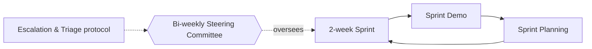

# Modernization Roadmap — 46 Weeks / 23 Sprints

> Mirrors the AWS "Modernization Timeline" slide. Two-week sprints, demos, planning;
> **bi-weekly Steering Committee**; established AWS/FIS escalation & triage protocols.

---

## 1. Program Shape

| Phase | Duration | Theme | DB target |
|-------|----------|-------|-----------|
| **Phase 1** | ~26 weeks (W1–W26) | **Modernize** — lift to AWS, add HA/DR, DevOps, decouple settlement | MSSQL Server **Multi-AZ on EC2** |
| **Phase 2a** | ~32 weeks (W15–W46, overlapping) | **Re-architect** — app tier + **Aurora PostgreSQL** | **RDS Aurora PostgreSQL** |
| **Phase 2b** | overlapping tail | **Re-architect** — workloads not yet PG-ready | **RDS SQL Server** |

---

## 2. Gantt (Mermaid)

```mermaid
gantt
    title Sunrise Prepaid Modernization — 46 Weeks / 23 Sprints
    dateFormat  X
    axisFormat  W%s

    section Phase 1 (Modernize)
    Initial Setup                 :p1a, 0, 2w
    Database Modernization        :p1b, 2, 13w
    Application Modernization     :p1c, 2, 14w
    Observability                 :p1d, 3, 3w
    Resiliency, Testing & Support :p1e, 15, 12w

    section Phase 2a (Aurora PG)
    Application Re-architecture   :p2aa, 14, 26w
    Database Modernization        :p2ab, 22, 18w
    Resiliency, Testing & Support :p2ac, 40, 6w

    section Phase 2b (RDS SQL Server)
    Application Re-architecture   :p2ba, 14, 26w
    Database Modernization        :p2bb, 34, 6w
    Resiliency, Testing & Support :p2bc, 40, 6w
```

> Weeks are approximate, read off the AWS slide's bar positions; treat as planning-grade,
> to be firmed up in sprint planning.

---

## 3. Workstream Detail

### Phase 1 — Modernize (W1–W26)

| Workstream | What happens | Key AWS services |
|------------|--------------|------------------|
| **Initial Setup** | Landing zone, accounts, VPC/network, Terraform baseline, CI/CD skeleton | Control Tower, Terraform, CodePipeline |
| **Database Modernization** | Lift SQL Server to **EC2 Multi-AZ**, enable **Always On AG** auto-failover (10–30s), **RCSI** on Gemini, consolidate **PV1+PV2**, move off Simple recovery model | EC2, MSSQL Multi-AZ, FSx/EBS |
| **Application Modernization** | Containerize/host on **EKS**, remove DB locking bottlenecks to enable horizontal scaling, **Settlement** parallel processing | **EKS, Glue Spark, Lambda, Transfer Family, Kinesis, SQS** |
| **Observability** | Metrics/tracing, Settlement Ops UI, operational runbooks | **CloudWatch, X-Ray** |
| **Resiliency, Testing & Support** | Multi-region **active-warm DR**, failover orchestration, **chaos engineering**, capacity validation | Route 53, chaos tooling, **Secrets Manager** |

**Phase 1 exit criteria:** 99.99% availability via Always On AG; on-prem eliminated;
settlement time cut ~half; CI/CD + IaC in place; DR validated.

### Phase 2 — Re-architect (W15–W46)

| Workstream | What happens | Key AWS services |
|------------|--------------|------------------|
| **Application Re-architecture** | **Extract stored-proc logic → Java/Spring Boot on EKS** (DB becomes **CRUD-only**); **SOAP .NET → REST**; microservices; Windows → Linux | **EKS (multi-AZ autoscaling)**, API Gateway/ALB |
| **Database Modernization (2a)** | **EC2 MS SQL Server → RDS Aurora PostgreSQL**; **KMS** encryption replacing **TDE** | **RDS Aurora PostgreSQL, KMS, DMS, SCT** |
| **Database Modernization (2b)** | Workloads not yet PG-ready → **RDS SQL Server** (managed lift) | **RDS SQL Server** |
| **Resiliency, Testing & Support** | Parity/reconciliation testing, cutover, hardening | DMS validation, test harness |

**Phase 2 exit criteria:** SP logic in app tier; DB CRUD-only; Aurora PG live (2a) / RDS
SQL Server live (2b); Windows/SQL licenses eliminated where migrated; KMS in place.

---

## 4. Sprint Cadence & Governance

- **Delivery:** two-week sprints, demos, planning (existing AWS/FIS program model).
- **Governance:** bi-weekly Steering Committee; current escalation path & triage protocols.
- **23 sprints** across 46 weeks.

---

## 5. Dependency & Sequencing Notes

1. **Initial Setup** must land the Terraform baseline + CI/CD before other streams scale.
2. **Phase 1 DB modernization (Always On AG)** de-risks availability *before* the deeper
   re-architecture — you get to 99.99% early.
3. **Application Re-architecture** (SP extraction) begins mid-program (≈W15) and runs long —
   it is the critical path for Phase 2.
4. **Aurora PG migration (2a)** depends on SP logic being lifted out first (DB must be
   CRUD-only to make a clean PostgreSQL cutover feasible).
5. **RDS SQL Server (2b)** is the safety valve for anything not PostgreSQL-ready by cutover.

---

## 6. Risk Callouts Tied to the Timeline

| Risk | Timing | Mitigation |
|------|--------|------------|
| SQL Server 2016 **EOL Jul 14 2026** | Hard deadline | Phase 1 DB modernization must complete before EOL |
| 1,771-article bi-directional replication decommission | Phase 1→2 | Stage carefully; keep replication until app-tier CRUD is proven |
| SP extraction underestimated | Phase 2 critical path | Inventory early (Phase 1), classify, size per procedure |
| Aurora cutover data parity | Phase 2a tail | DMS validation + financial reconciliation + parallel run |
