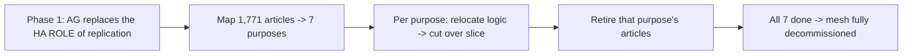

# Runbook 03 — Decommission the 1,771-Article Bi-Directional Replication

**Goal:** Safely retire the fragile Phoenix ↔ Little Rock **bi-directional replication mesh**
(1,771 articles across 7 business purposes) without disrupting the business. **Do NOT recreate
this mesh on AWS** — HA/DR is provided natively by Always On AG (Phase 1) and Aurora Multi-AZ
+ cross-region (Phase 2).

**Owners:** DBA lead, SRE.

---

## Principle: retire in slices, never all at once

The 1,771 articles map to **7 business purposes**. Each purpose is retired only **after** its
logic has moved to the app tier and its slice has cut over (`02-phase2a-aurora-cutover.md`).



## Step 1 — Replace the HA role first (Phase 1)

- Stand up **Always On AG** (Runbook 01). This removes replication's *availability* purpose,
  so what remains is only data-distribution the app still depends on.

## Step 2 — Inventory & map

- [ ] Export the full article list (all 1,771) with source/target tables + business purpose.
- [ ] Group into the **7 purposes**; identify which app functions read each replicated set.
- [ ] Record article counts per purpose (already tracked in the SP inventory
      `../stored-proc-extraction/inventory-template.csv`, `replication_articles` column).

## Step 3 — Per-slice retirement (repeat for each of the 7 purposes)

1. Confirm the slice has **cut over to Aurora** (Runbook 02 complete).
2. Confirm no remaining consumers read that slice's replicated tables (query monitoring/logs).
3. **Disable** the publications/subscriptions for that slice's articles:
   ```sql
   -- Example (SQL Server transactional replication): drop a subscription/article.
   EXEC sp_dropsubscription @publication = N'<pub>', @article = N'<article>', @subscriber = N'<sub>';
   EXEC sp_droparticle       @publication = N'<pub>', @article = N'<article>';
   ```
4. **Observe** for the agreed soak period (e.g., 48–72h) — watch for errors/missing data.
5. Mark the slice's articles **retired** in the inventory.

## Step 4 — Final teardown

- [ ] After all 7 purposes are retired, drop the remaining publications and the distributor.
- [ ] Decommission the secondary (Little Rock) replication role.
- [ ] Confirm HA/DR now relies solely on AG / Aurora Multi-AZ + cross-region.

## Rollback (per slice)

If a retired slice causes issues within the soak period, re-enable that slice's articles from
the retained configuration (keep the publication scripts versioned) and re-sync. Because we
retire **one slice at a time**, blast radius stays small.

## Success criteria

- All 1,771 articles retired across the 7 purposes.
- No bi-directional mesh on AWS; native HA/DR in place.
- Distributor/secondary role decommissioned.
